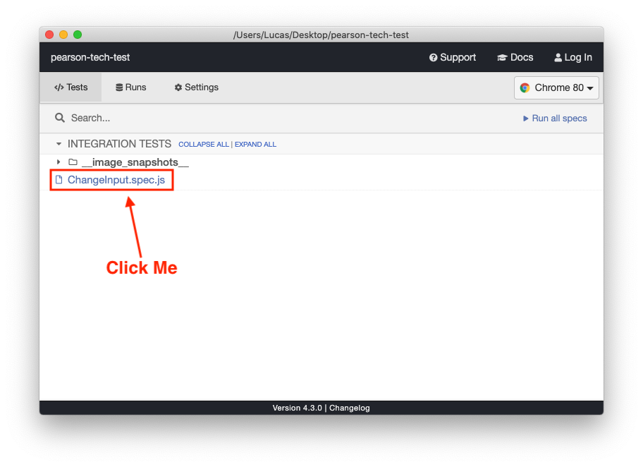

# Pearson Technical Test

Thank you for considering my application! This directory contains my attempt at the technical test that was given.

## Setup

```sh
yarn
yarn watch
```

This will open up a server at `http://localhost:1234` where this app is hosted.

## Testing

I included both unit and E2E tests in this project, utilising visual regression snapshots for my E2E tests. The unit tests are done using Jest and React Testing Library, and the E2E tests are done using Cypress.

To run unit tests:

```sh
yarn test
```

To run Cypress E2E tests:

```sh
yarn test:cypress
```

After this, please click the link shown below:



This will run the automated E2E/visual regression tests!

## Assumptions I Made

1. I attempted this tech test over the course of a day. Given more time and creative freedom I would have liked to provide the simulation with good looking styles.
2. I came up with a novel solution for the instruction to provide the slider with an exponential/logarithmic scale, providing more detail towards the negative side. I created an exponential function with domain x: [-1, 1] and range y: [-1, 1] passing through the points (-1, -1) and (1, 1) and controlled by an offset. This would allow the velocity [-100, 100] to be easily mapped and for the slider's max and min attributes to 1 and -1 respectively. The offset would allow the shape of the curve to be easily controlled. For a graphical demonstration, see: https://www.desmos.com/calculator/gd38fsx3y6
3. I used Parcel over Webpack/Create React App simply for the sake of convenience. I prefer to use Webpack for its power in larger-scale projects, but decided to go with Parcel for this one.

## Demo Recording

I've included a recording of me using the app - you can find this under this repository at [App Demo.mp4](./App%20Demo.mp4).
